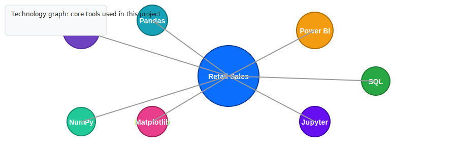

# Retail Sales Analytics

Professional retail sales analytics project focused on cleaning, exploring, and visualizing sales data to extract actionable insights. This repository contains Jupyter notebooks, visual artifacts, and guidance to reproduce analyses and dashboards.

## Table of contents

- [Overview](#overview)
- [Features](#features)
- [Repository structure](#repository-structure)
- [Data](#data)
- [Getting started](#getting-started)
- [Notebooks & scripts](#notebooks--scripts)
- [Visuals & Dashboards](#visuals--dashboards)
- [Architecture](#architecture)
- [Technology graph](#technology-graph)
- [Contributing](#contributing)
- [License](#license)
- [Contact](#contact)

## Overview

Retail Sales Analytics provides an end-to-end working example for analyzing point-of-sale and retail datasets. The goal is to help analysts and data practitioners:

- Clean and prepare sales and transactional data.
- Explore sales trends, seasonality, and product/category performance.
- Build reproducible visualizations and dashboards (Power BI or notebook-based).
- Share clear insights and recommendations for business decisions.

## Features

- Data ingestion and basic validation (CSV / SQL / local files)
- Data cleaning and feature engineering using Pandas & NumPy
- Exploratory data analysis (EDAs) with plots and tables
- Reproducible Jupyter notebook demonstrating workflow
- Export-ready visualizations and Power BI-ready artifacts

## Repository structure

- `IOT Project main .ipynb` — primary Jupyter notebook with analysis and visualizations
- `assets/` — diagrams and images used in this README
- `README.md` — this document

> Note: add your raw data files to a `data/` folder (gitignored) or point scripts to their data source.

## Data

This project uses retail transaction data (CSV / POS exports). The README doesn't include data for privacy reasons — add your own dataset to a local `data/` directory or configure a data source in the notebooks.

Suggested columns in dataset:

- transaction_id, date, store_id, product_id, category, quantity, price, revenue

## Getting started

Minimal steps to run the provided notebook locally.

1. Install Python 3.9+ (recommended) and create a virtual environment.
2. Install required packages (example):

	pip install -r requirements.txt

3. Open the notebook in Jupyter:

	jupyter notebook "IOT Project main .ipynb"

If you prefer Power BI for dashboards, import or connect to the processed CSV or a small SQL table exported from the notebook.

## Notebooks & scripts

- `IOT Project main .ipynb` — contains the main data cleaning, EDA, and sample visualizations. Read the top cells for environment and dataset instructions.

Tips:

- Keep long-running data processing outside notebooks in scripts for reproducibility.
- Use small sample files for iterative development and the full dataset for final runs.

## Visuals & Dashboards

This repo demonstrates common visualizations for retail analytics:

- Time series of revenue and quantity sold
- Top products by revenue and margin
- Sales by store and region
- Seasonal trends and moving averages

Power BI: export processed tables (CSV or SQL) and build dashboards in Power BI Desktop or Power BI Service.

## Architecture

Below is a simplified architecture showing data flow from sources to insights.

## Technology graph

Key technologies and tools used in this project are shown below.

## Quick checklist / contract

- Inputs: CSV or SQL retail transaction data
- Outputs: exploratory visualizations, summary tables, dashboards
- Error modes: missing columns, malformed dates, duplicate transaction IDs — notebook includes simple checks

Edge cases considered:

- Empty or partial datasets — notebook runs with guarded checks
- Large files — process in chunks or using a database
- Missing price/quantity — flagged and either imputed or removed

## Contributing

Contributions are welcome. Suggested steps:

1. Fork the repository.
2. Create a branch for your feature or fix.
3. Add tests or verify notebooks run end-to-end.
4. Open a pull request with a clear description.

## License

This project is provided under the MIT License — adapt as needed for your organization.

## Contact

Project maintainer: Ashish Rastogi (repository owner)

---

If you'd like, I can also:

- Add a `requirements.txt` generated from the notebook.
- Create a small `data/README.md` describing expected dataset columns and example sample.
- Add a `.gitignore` that excludes data files and environment folders.

If you want any of those, tell me which and I'll add them next.
